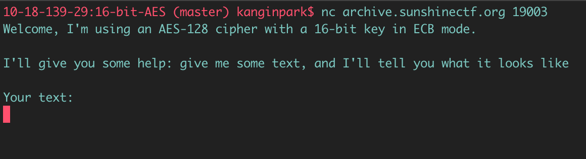

# SunshineCTF 2019 : 16-bit-AES

**Category:** Crypto  
**Points:** 100  
**Author:** ps_iclimbthings  
**Description:**  
> Why so small?
>
> nc archive.sunshinectf.org 19003

## Write-up

There were two ways of solving this challenge. One way was much easier than the other, and I doubt it was the intended solution.  
I will first go over the proper way, and then go over the easier way.

When I first connect to the server, I get the following message:  

After sending some text, it asks me to encrypt some randomly generated text with the same key:

