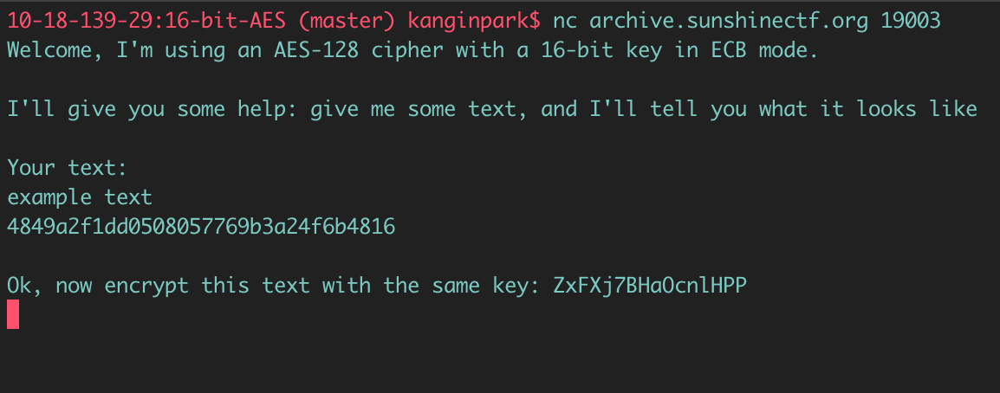

# SunshineCTF 2019 : [16-bit-AES](https://2019.sunshinectf.org/challenges#16-bit-AES)

**Category:** Crypto  
**Points:** 100  
**Author:** ps_iclimbthings  
**Description:**  
> Why so small?
>
> nc archive.sunshinectf.org 19003

## Write-up

There were two ways of solving this challenge. One way was much easier than the other, and I doubt it was the intended solution.  
I will first explain the proper way, and then go over the easier way.

### Challenge explanation

When I first connect to the server, I get the following message: 


After sending some text, it asks me to encrypt some randomly generated text with the same key: 



If I give it the correctly encrypted ciphertext, it will give me the flag.

### Challenge solution

1. Although this first step of leaking the padding scheme wasn't really necessary to solve the challenge, I decided to do it anyway.  
Since the server is using AES-128 in ECB mode, the encryption is deterministic. If I give it the same plaintext block, it will always respond with the same ciphertext. This means that I can bruteforce the padding one character at a time. For example, if I send the following plaintext which consists of 15 'A's:
```
AAAAAAAAAAAAAAA
```
the server will pad the plaintext with one unknown character.
```
AAAAAAAAAAAAAAA?
```
Then the server will encrypt the padded plaintext with its 16-bit key in ECB mode and send me the ciphertext.

Now, since the encryption method is deterministic, I can bruteforce that last character. For example, I can send the following plaintext which consists of 15 'A's and 1 'a':
```
AAAAAAAAAAAAAAAa
```
If 'a' is the right padding character, the server will send me the same ciphertext as it did when I sent only 15 'A's as the plaintext. If not, I can move on to the next possible character and continue bruteforcing.

Using the above technique revealed that the padding character was just a lowercase 'x'.

